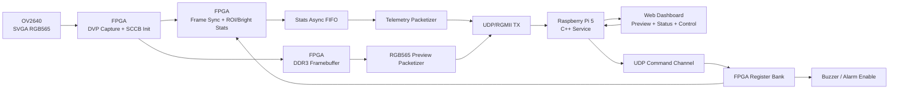

# 基于 FPGA + Linux 的边缘智能巡检感知节点

一个面向端侧巡检场景的 FPGA + Linux 感知节点项目。系统使用 `OV2640` 摄像头、`ACX750 / XC7A100T` FPGA 开发板和树莓派 5，完成图像采集、FPGA 预处理、DDR3 帧缓存、UDP/RGMII 传输、Linux C++ 服务、Web 控制台、参数热更新和告警联动。

项目目标不是单独验证某个 FPGA 模块，也不是纯软件展示页面，而是构建一条可以演示的端侧系统链路：

```text
OV2640 摄像头
  -> FPGA DVP 采集 / ROI 统计 / DDR3 帧缓存
  -> UDP/RGMII 图像与遥测回传
  -> Raspberry Pi 5 C++ 服务
  -> Web 预览 / 参数控制 / 告警事件
```

## 功能特性

- **真实摄像头输入**：支持一路 `OV2640 800x600 RGB565` 图像输入。
- **FPGA 数据通路**：实现 DVP 采集、SCCB 初始化、RGB565 组包、DDR3 帧缓存、UDP/RGMII 回传。
- **FPGA 预处理**：按 ROI 统计 `roi_sum`、`bright_count`、`active_pixel_count`，并根据阈值生成 `alarm_active`。
- **运行时控制**：Linux 侧可在线下发 `ROI / bright_threshold / alarm_count_threshold / tx_mode`。
- **Linux C++ 服务**：包含 UDP 接收、命令发送、HTTP API、配置加载、日志、在线判定和 systemd 部署。
- **Web 控制台**：显示摄像头预览、状态卡片、ROI 框选、告警状态、告警事件表和快照链接。
- **告警联动**：`bright_count >= alarm_count_threshold` 时触发 Web 告警、事件记录和蜂鸣器提示。

## 系统架构



## 已验证能力

- `SVGA 800x600 RGB565` 摄像头画面可回传到 Web 预览区。
- `/api/status` 可返回在线状态、遥测字段、预览元数据和运行参数。
- FPGA 侧可输出 `active_pixel_count / roi_sum / bright_count / alarm_active`。
- Web 侧支持在预览图上拖拽框选 ROI，并自动换算为 FPGA 坐标。
- Linux 侧可通过 HTTP API 下发 ROI、亮度阈值、告警阈值和传输模式。
- 告警事件表可记录时间、帧号、ROI、`bright_count/threshold`、`roi_sum` 和快照链接。
- 蜂鸣器在告警触发后输出约 0.5 秒、约 2 kHz 方波提示。

## 目录结构

```text
.
├── README.md
├── 数据包格式.txt
├── docs/
│   ├── ARCHITECTURE.md
│   ├── DEMO_GUIDE.md
│   ├── DEMO_CHECKLIST.md
│   ├── DEMO_VIDEO_SCRIPT_90S.md
│   ├── IMAGE_PATH_AND_DDR3.md
│   ├── INTERVIEW_NOTES.md
│   ├── RESUME_PROJECT.md
│   └── SOURCE_READING_GUIDE.md
├── edge_node_service/
│   ├── config/
│   ├── include/
│   ├── src/
│   ├── web/
│   ├── CMakeLists.txt
│   └── edge-node.service
└── edge_vision_node_fpga/
    ├── constrs/
    ├── doc/
    ├── rtl/
    └── README.md
```

第三方芯片手册、Vivado 生成文件、bitstream、构建目录和个人复盘文档不包含在公开仓库中。

## 快速运行

### FPGA 侧

主顶层：

```text
edge_vision_node_fpga/rtl/top/top_ov2640_ddr3_udp_preview.v
```

约束文件：

```text
edge_vision_node_fpga/constrs/top_ov2640_ddr3_udp_preview.xdc
```

Vivado 建工程时参考：

- `edge_vision_node_fpga/doc/VIVADO_SOURCE_LIST_DDR3.md`
- `edge_vision_node_fpga/doc/IP_REQUIREMENTS_DDR3.md`

工程依赖的 DDR3 MIG、FIFO、clock wizard 等 IP 需要在 Vivado 中按文档创建或加入。

### Linux 服务

在树莓派侧构建并启动服务：

```bash
cd ~/edge_node_service
rm -rf build
mkdir build
cd build
cmake ..
make -j4
sudo systemctl restart edge-node.service
```

访问 Web 控制台：

```text
http://<raspberry-pi-ip>:5000/
```

状态接口：

```bash
curl http://127.0.0.1:5000/api/status
```

## Web 演示流程

1. 打开 Web 控制台，确认 `ONLINE`、摄像头预览画面和 `800 x 600` 分辨率。
2. 在预览图上拖拽框选 ROI，页面自动填写 `ROI_X/Y/W/H` 并显示 ROI 边框。
3. 点击 `下发当前 ROI`，观察 `roi_sum / bright_count` 随巡检区域变化。
4. 点击 `低阈值演示`，触发 `alarm_active=1`。
5. 观察 ROI 框、预览边框和 Alarm 卡片变红，蜂鸣器响约 0.5 秒。
6. 在告警事件表中查看触发时间、帧号、ROI、亮点数、阈值、`roi_sum` 和快照链接。
7. 使用 `buzzer_off / buzzer_on` 验证告警使能控制。

## 关键接口

- `GET /api/status`：返回节点在线状态、遥测、预览信息、运行参数和告警事件。
- `GET /api/preview`：返回最近一帧预览图像。
- `GET /api/apply_params`：下发 ROI、阈值和传输模式。
- `GET /api/command`：下发基础控制命令，例如 `start_capture`、`stop_capture`、`buzzer_on`、`buzzer_off`。

## 文档

- `docs/ARCHITECTURE.md`：系统架构和数据链路说明。
- `docs/DEMO_GUIDE.md`：完整演示流程。
- `docs/DEMO_CHECKLIST.md`：演示前检查清单。
- `docs/DEMO_VIDEO_SCRIPT_90S.md`：90 秒演示视频脚本。
- `docs/IMAGE_PATH_AND_DDR3.md`：图像路径与 DDR3 说明。
- `docs/SOURCE_READING_GUIDE.md`：源码阅读顺序和重点。
- `docs/INTERVIEW_NOTES.md`：面试讲解要点。
- `docs/RESUME_PROJECT.md`：简历项目写法。

## 项目边界

本项目当前定位为规则型边缘巡检感知节点，重点展示 FPGA 实时采集预处理、Linux 边缘服务和系统联调能力。

不包含：

- 深度学习训练链路。
- 云端平台或多租户系统。
- 机器人整机控制。
- 多传感器融合。

## 可展开方向

- 告警事件导出为 CSV/JSON。
- 多组 ROI 和规则配置。
- Linux 侧轻量模型推理。
- Web 端历史事件回放和统计报表。
