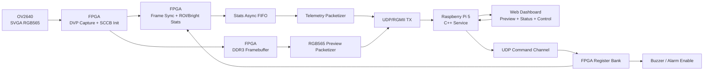

# 基于 FPGA + Linux 的边缘智能巡检感知节点

面向端侧巡检场景的完整感知节点项目。系统由 `OV2640` 摄像头、`ACX750/XC7A100T` FPGA 开发板和树莓派 5 组成，完成摄像头采集、FPGA 预处理、DDR3 帧缓存、千兆以太网回传、Linux C++ 服务、Web 展示、参数热更新和告警控制。

这不是单独的 FPGA 点灯实验，也不是纯软件 Web demo，而是一个可以演示的端侧系统闭环：

```text
OV2640 输入 -> FPGA 采集/预处理 -> DDR3/FIFO 缓冲 -> UDP/RGMII -> Raspberry Pi 5 -> C++ 服务 -> Web 控制台
```

## 一眼看项目

- **真实输入**：一路 `OV2640 800x600 RGB565` 摄像头画面进入 FPGA。
- **FPGA 真处理**：完成 DVP 采集、帧同步、ROI 亮度累加、亮点计数、阈值告警、DDR3 帧缓存和 UDP/RGMII 回传。
- **Linux 真服务**：树莓派 5 上运行 C++ 多线程服务，负责 UDP 接收、命令下发、HTTP API、Web 控制台、日志和 systemd 部署。
- **完整闭环**：预览画面上拖拽框选 ROI，在线下发参数，FPGA 侧统计变化，超阈值后触发 Web 告警、事件快照和蜂鸣器。

建议用于 README 首屏的截图：

- Web 告警页截图：`docs/assets/web_alarm_dashboard.png`
- 架构图截图或导出图：`docs/assets/system_architecture.png`

## 当前状态

当前主线已经跑通并实测：

- `SVGA 800x600 RGB565` 摄像头画面可回传到 Web 预览区。
- FPGA 侧可统计 `active_pixel_count / roi_sum / bright_count`。
- Linux 侧可通过 HTTP API/Web 页面热更新 `ROI / bright_threshold / alarm_count_threshold / tx_mode`。
- 告警链路已闭环：`bright_count >= alarm_count_threshold` 时 `alarm_active=1`，并联动蜂鸣器。
- Web 侧支持在预览画面上拖拽框选 ROI，并自动换算为 FPGA 坐标。
- 告警事件表记录时间、帧号、ROI、`bright_count/threshold`、`roi_sum` 和快照链接。
- 命令链路已验证：`start_capture / stop_capture / buzzer_on / buzzer_off / apply_params` 可被 FPGA 接收。
- 状态链路已验证：`/api/status` 返回 `online=true`、`has_telemetry_packet=true`、`error_code=0`。

## 系统架构



## 功能边界

已完成：

- 一路真实摄像头输入：`OV2640 DVP`。
- FPGA 采集与预处理：帧同步、有效像素统计、ROI 亮度统计、亮点计数。
- DDR3 帧缓存与 RGB565 预览回传。
- UDP/RGMII 遥测上报和命令接收。
- Linux C++ 多线程服务：UDP 接收、命令发送、HTTP 控制台、配置、日志、在线判定。
- Web 展示：状态卡片、摄像头预览、参数热更新、基础控制、告警状态。
- 告警机制：亮点数阈值判断、蜂鸣器使能、蜂鸣器保持时间。

暂不做：

- 复杂深度学习训练链路。
- 云端平台或多租户系统。
- 机器人整机控制。
- 多传感器大杂烩。

## 目录结构

- `edge_vision_node_fpga/`：FPGA RTL、约束、Vivado 源文件清单、IP 需求。
- `edge_node_service/`：树莓派 5 C++ 服务、配置、systemd、Web 控制台。
- `docs/`：架构说明、演示脚本、简历写法、问题定位记录。
- `OV2640/`：摄像头模组资料。

## 快速运行

### FPGA 侧

当前主顶层：

```text
edge_vision_node_fpga/rtl/top/top_ov2640_ddr3_udp_preview.v
```

约束文件：

```text
edge_vision_node_fpga/constrs/top_ov2640_ddr3_udp_preview.xdc
```

Vivado 建工程时参考：

- `edge_vision_node_fpga/doc/VIVADO_SOURCE_LIST_DDR3.md`
- `edge_vision_node_fpga/doc/IP_REQUIREMENTS_DDR3.md`

### 树莓派侧

```bash
cd ~/edge_node_service
rm -rf build
mkdir build
cd build
cmake ..
make -j4
sudo systemctl restart edge-node.service
```

访问：

```text
http://树莓派IP:5000/
```

状态检查：

```bash
curl http://127.0.0.1:5000/api/status
```

## 推荐演示

1. 打开 Web 页面，展示 `ONLINE`、摄像头预览画面、`800 x 600`。
2. 展示顶部状态卡片和 `/api/status` 中 `frame_id` 增长、`error_code=0`、`fifo_overflow=0`。
3. 在预览画面上拖拽框选 ROI，确认 `ROI_X/Y/W/H` 自动换算并显示黄色 ROI 框。
4. 点击 `下发当前 ROI`，观察 `roi_sum / bright_count` 随巡检区域变化。
5. 点击 `低阈值演示`，展示 `alarm_active=1`、ROI 框/预览边框变红、蜂鸣器响约 0.5 秒、告警事件表新增记录。
6. 打开告警事件快照，说明事件包含时间、帧号、ROI、`bright_count/threshold` 和 `roi_sum`。
7. 执行 `buzzer_off`，展示 `alarm_enable=0`、页面 Alarm 变为 `DISABLED`。
8. 执行 `buzzer_on`，恢复告警闭环。

详细脚本见：

- `docs/DEMO_GUIDE.md`
- `docs/DEMO_VIDEO_SCRIPT_90S.md`
- `docs/DEMO_CHECKLIST.md`
- `docs/PROBLEM_SUMMARY.md`
- `docs/INTERVIEW_NOTES.md`
- `docs/RESUME_PROJECT.md`

## 简历定位

项目名：

```text
基于 FPGA + Linux 的边缘智能巡检感知节点
```

核心卖点：

- FPGA 侧真实完成接口、时序、跨时钟域、DDR3/FIFO 缓冲、UDP 数据通路和轻量预处理。
- Linux 侧真实完成多线程 Socket 服务、HTTP 控制台、配置、日志、服务化部署。
- 系统形成采集、处理、传输、展示、配置、告警的完整闭环。
- 背景贴近边缘智能、智能巡检、工业视觉前端，而不是传统课程设计。
