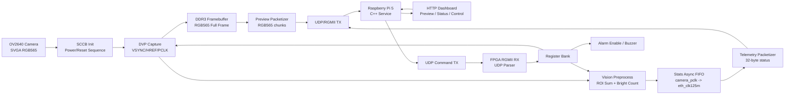

# 系统架构说明

## 总体架构



## FPGA 数据面

摄像头数据先进入 DVP 采集模块，再分成两条路径：

- 图像路径：`OV2640 -> Capture -> DDR3 Framebuffer -> RGB565 Preview Packetizer -> UDP TX`
- 统计路径：`OV2640 -> Capture -> Vision Preprocess -> Stats FIFO -> Telemetry Packetizer -> UDP TX`

这样设计的好处是预览和统计互不阻塞。预览链路负责展示最近画面，统计链路负责稳定输出巡检指标和告警结果。

## FPGA 控制面

树莓派通过 UDP 命令包写 FPGA 寄存器。当前支持：

- 采集开关：`START_CAPTURE / STOP_CAPTURE`
- 告警使能：`BUZZER_ON / BUZZER_OFF`
- 错误清除：`CLEAR_ERROR`
- 参数热更新：`ROI_X / ROI_Y / ROI_W / ROI_H / BRIGHT_THRESHOLD / ALARM_COUNT_THRESHOLD / TX_MODE`

命令接收链路经过 RGMII RX、UDP 解析、命令包校验、异步 FIFO 和寄存器组，最后同步到相机/统计域。

## Linux 服务

树莓派 5 上运行 `edge_node_service`，核心线程：

- `rx_loop`：接收 FPGA UDP 包，解析遥测和预览分片。
- `http_loop`：提供 Web 控制台和 JSON API。
- `watchdog_loop`：在线状态判定和配置热重载。

服务输出：

- `/api/status`：节点状态、遥测、运行参数、预览元数据。
- `/api/preview`：最近一帧 RGB565 转 BMP 后的图像。
- `/api/apply_params`：批量下发 ROI/阈值/模式。
- `/api/command`：下发基础控制命令。

## 告警逻辑

FPGA 在每帧结束时计算：

```text
alarm_active = alarm_enable && (bright_count >= alarm_count_threshold)
```

蜂鸣器输出不是直接使用单帧脉冲或恒定电平，而是在约 0.5 秒保持窗口内输出约 2 kHz 方波，避免无源蜂鸣器只在电平跳变瞬间响一下。`BUZZER_OFF` 会关闭 `alarm_enable`，`CLEAR_ERROR` 会清除保持计数。

## 当前工程状态

已验证链路：

- 摄像头预览：`800x600 RGB565 BMP`
- 遥测包：`has_telemetry_packet=true`
- 命令接收：ROI、阈值、蜂鸣器开关可生效
- 告警判断：`bright_count` 与 `alarm_count_threshold` 对比后更新 `alarm_active`
- 错误状态：正常运行时 `error_code=0`、`cmd_error=0`

当前版本可以作为“端侧巡检感知节点”的完整主线。后续若继续扩展，优先考虑事件日志导出、演示视频和轻量规则库，而不是引入过重云端或训练链路。
